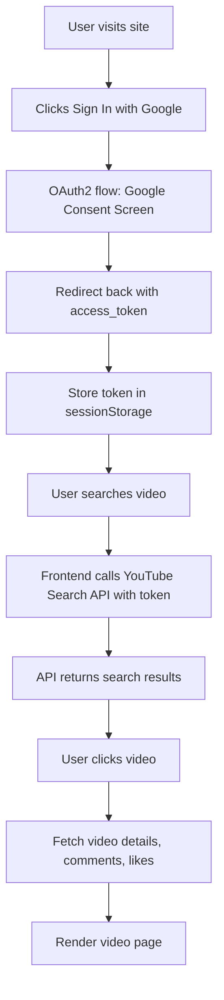
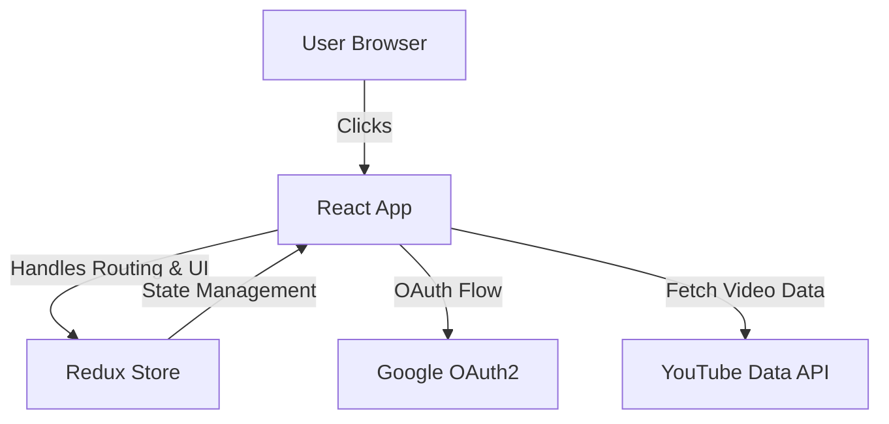

# 📺 YouTube Clone — React + Google OAuth2

A **YouTube clone web app** built with **React**, **Redux Toolkit**, **TailwindCSS**, and **Google OAuth2** for authentication.  
This project demonstrates searching YouTube videos, viewing details, comments, likes/dislikes, and more — using the **YouTube Data API v3**.

---

## 🚀 Features

✅ Google OAuth2 login  
✅ Video search using YouTube Data API  
✅ Video details view  
✅ Play videos  
✅ Comments section  
✅ Like & dislike videos  
✅ Channel info  
✅ Simple state management with Redux Toolkit  
✅ Tailwind CSS for responsive UI

---

## 🧩 Tech Stack

- **React 18**
- **Redux Toolkit**
- **React Router DOM**
- **Tailwind CSS**
- **Google OAuth2**
- **YouTube Data API v3**

---

## 🔑 APIs & Constants

This project uses the following endpoints:

```js
export const YOUTUBE_API_KEY = "<YOUR_YOUTUBE_API_KEY>";
export const OAUTH_CLIENT_ID = "<YOUR_GOOGLE_OAUTH_CLIENT_ID>";

export const YOUTUBE_DATA_API =
  "https://youtube.googleapis.com/youtube/v3/videos?part=snippet%2CcontentDetails%2Cstatistics&chart=mostPopular&maxResults=20";

export const YOUTUBE_SUGGESTION_API =
  "https://suggestqueries.google.com/complete/search?client=firefox&ds=yt&q=";

export const YOUTUBE_COMMENT_API =
  "https://youtube.googleapis.com/youtube/v3/commentThreads?part=snippet,replies&maxResults=5&textFormat=plainText&videoId=";

export const YOUTUBE_VIDEO_INFO_API =
  "https://youtube.googleapis.com/youtube/v3/videos?part=snippet%2CcontentDetails%2Cstatistics&id=";

export const YOUTUBE_CHANNEL_INFO_API =
  "https://youtube.googleapis.com/youtube/v3/channels?part=snippet%2CcontentDetails%2Cstatistics&id=";

export const YOUTUBE_SEARCH_API =
  "https://youtube.googleapis.com/youtube/v3/search?part=snippet&maxResults=10&q=";
````

---

## 🧰 State Management

The app uses **Redux Toolkit** with these slices:

* **`appSlice`** — UI state (like toggles)
* **`cacheSlice`** — caches search suggestions (if used)
* **`chatSlice`** — handles live chat features (if integrated)

```js
const store = configureStore({
  reducer: {
    toggle: appSlice,
    suggestionCache: cacheSlice,
    LiveChatSlice: chatSlice,
  },
});
```

---

## 🔐 Google OAuth2

* Uses Google’s **OAuth2** implicit flow.
* Requires:

  * A **Google Cloud Project**
  * OAuth2 **Client ID** for Web Application
  * Authorized redirect URI (e.g., `http://localhost:3000`)

👉 **Important:**

* Add your Google account as a **test user** while the app is unverified.
* Use **OAuth consent screen** in Google Cloud Console.

---

## ⚙️ How to Run Locally

1️⃣ Clone the repo

```bash
git clone https://github.com/your-username/your-repo.git
cd your-repo
```

2️⃣ Install dependencies

```bash
npm install
```

3️⃣ Setup your `.env`:

```bash
REACT_APP_YOUTUBE_API_KEY=YOUR_YOUTUBE_API_KEY
REACT_APP_OAUTH2_API_KEY=YOUR_GOOGLE_CLIENT_ID
```

4️⃣ Start the dev server

```bash
npm start
```

---

## 🔄 Basic Workflow



---

## 🗂️ Simple Architecture



---

## 📃 License

This project is for **educational/demo purposes only**.
For real production apps, you must comply with **Google API terms**, handle **OAuth PKCE**, and get proper **API verification**.

---

## 🙌 Author

**Developed by \[APURVA SINGH]**

----